<p align="center">
  
</p>

<h1 align="center" style="border-bottom: none">
    🏛️ Parthenon: A Gamified Web3 Learning Experience
</h1>

> [!NOTE]
> This project was created as part of [LLM Zoomcamp course](https://github.com/DataTalksClub/llm-zoomcamp/tree/main).

> Listen to an overview created by [NotebookLM](https://notebooklm.google/) 

https://github.com/user-attachments/assets/096f2b58-660e-4864-88a0-cedd308727e7

<div align="center">
If you like this project, please consider giving it a ⭐️ **star** to help others discover it, or 🍴 **fork** it to contribute!

[](https://github.com/dimzachar/Parthenon-RAG-Game/stargazers)
[](https://github.com/dimzachar/Parthenon-RAG-Game/network/members)
[](https://github.com/dimzachar/Parthenon-RAG-Game/issues)
[](https://github.com/dimzachar/Parthenon-RAG-Game/issues)
<br>
<a href="https://parthenon-rag.vercel.app/"></a>
</div>


## Overview

Parthenon is an immersive 2D top-down pixel-art game that incorporates a RAG system, allowing players to have dynamic, knowledge-based interactions while exploring the virtual world. Players learn about [Movementlabs](https://movementlabs.xyz/), a Move-based blockchain network, and its ecosystem through engaging NPC interactions.

This project integrates several technologies to create a robust system for querying a knowledge base, building prompts, and interacting with a LLM. It features:

- A backend with a RAG system, leveraging Elasticsearch for data retrieval and OpenAI language model for generating responses.
- PostgreSQL for storing and managing data.
- Grafana for monitoring key metrics such as user feedback, model costs, and other metrics.
- A React frontend for the game interface, built using the [Phaser](https://phaser.io/) game framework.

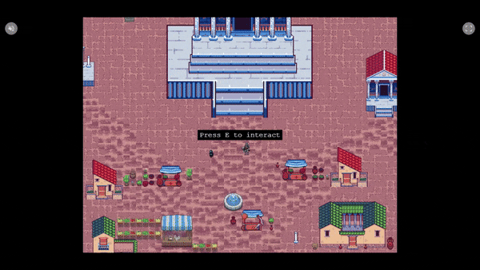

## 📔 Problem Statement

The core challenge is creating an end-to-end RAG application that seamlessly integrates an AI-driven assistant into an interactive gamified environment. It aims to:

1. Provide a smooth transition between gameplay and AI-assisted learning of the Movement ecosystem.
2. Streamline the process of data ingestion, retrieval, and interaction.
3. Deliver an accessible and user-friendly learning experience.

## 📚 Table of Contents

1. [Project Architecture & Technologies](#-project-architecture--technologies)
2. [Dataset](#dataset)
3. [Backend Overview](#backend-files-overview)
4. [Setup Instructions](#-setup-instructions)
5. [Running the Application](#running-the-application)
6. [Using the Application](#using-the-application)
7. [Monitoring](#monitoring)
8. [Frontend](#-frontend)
9. [FAQ](#-faq)
10. [Contributing](#-contributing)
11. [License](#-license)
11. [Donations](#-donations)

## 🏗️ Project Architecture & Technologies

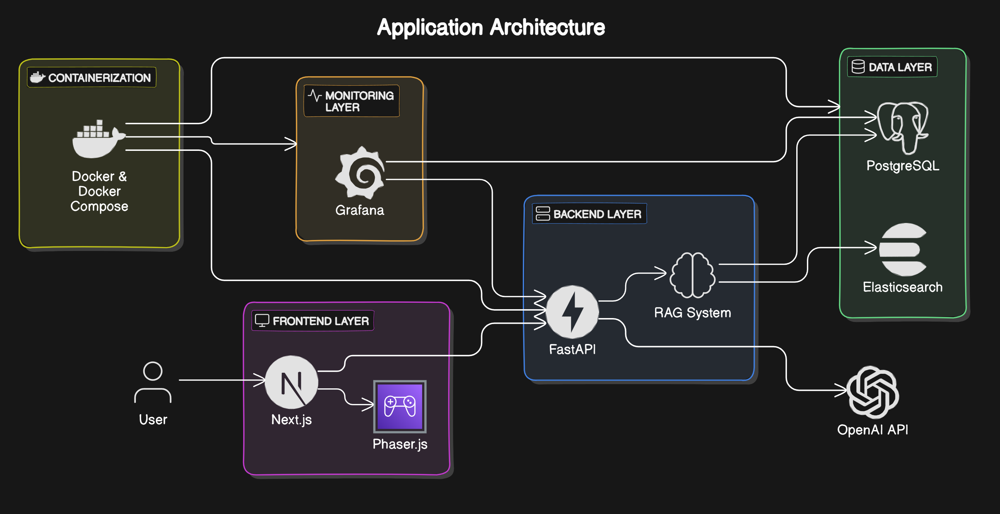

Parthenon is built on a modern, scalable architecture designed to deliver an engaging learning experience:

🛠️ Backend

- Language & Framework: Python 3.12 with FastAPI
- Functionality: Handles API requests, orchestrates the RAG system, and manages data flow
- Main Database: PostgreSQL for storing conversation data and user feedback
- Vector Database: Elasticsearch for efficient search
- LLM Integration: OpenAI API for powering AI-driven conversations

🎮 Frontend

- Framework: Next.js with TypeScript
- Functionality: Renders the game world and handles user interactions
- UI: React components styled with Tailwind CSS
- Game Engine: Phaser.js for 2D game mechanics

📊 Monitoring & DevOps

- Visualization: Grafana for real-time metrics and user interaction insights
- Containerization: Docker & Docker Compose for consistent deployment across environments

### Dataset

The dataset, containing information about Movementlabs and its ecosystem, is located in [`data/json`](data/json).

### Backend Files Overview

The backend of this application is structured to handle various aspects of the RAG flow, including data ingestion, retrieval, and interaction with the LLM. Below is an overview of the backend files:

- [`app.py`](backend/app/app.py): This is the main entry point of the FastAPI application. It defines the API endpoints for querying the knowledge base and submitting feedback. It also includes CORS middleware configuration to allow cross-origin requests (so that the frontend fetches data from the backend). API Endpoints:

	- `/faq`: Retrieves FAQ questions from the [ground truth](data/ground-truth-retrieval.csv) file.
	- `/question`: Handles RAG queries and returns AI-generated responses.
	- `/feedback`: Receives and stores user feedback on conversations.

- [`rag.py`](backend/app/rag.py): Contains the core logic for the RAG process. It handles querying Elasticsearch for relevant documents, building prompts for the LLM, and evaluating the relevance of the generated answers.

- [`db.py`](backend/app/db.py): Manages database interactions using PostgreSQL. It includes functions to initialize the database schema and save conversation and feedback data.

- [`prep.py`](backend/app/prep.py): Prepares the Elasticsearch index and initializes the database. It ingests documents into Elasticsearch and sets up the necessary index mappings.

- [`ingest.py`](backend/app/ingest.py): Responsible for loading and processing documents from the data directory. It cleans and chunks the text data before indexing it into Elasticsearch.

- [`init.py`](grafana/init.py): Script for initializing Grafana by creating API keys, setting up data sources, and configuring dashboards.

## 🚀 Setup Instructions

### Prerequisites

- Docker and Docker Compose
- Node.js (v14+)
- Python 3.12
- Git

### Environment Configuration

1. Clone the repository:

```bash
git clone https://github.com/dimzachar/Parthenon-RAG-Game.git
cd Parthenon-RAG-Game
```

### Environment Variables

2. Configure environment:

```bash
cp .env.example .env
```

or rename `.env.example` in the root directory to `.env`. Key environment variables:

- `ELASTIC_URL`: Elasticsearch connection URL
- `POSTGRES_DB`, `POSTGRES_USER`, `POSTGRES_PASSWORD`: PostgreSQL connection details
- `OPENAI_API_KEY`: Your OpenAI API key for LLM interactions
- `INDEX_NAME`: Name of the Elasticsearch index for the knowledge base

Replace `YOUR_KEY` with your Openai API key.

### Dependency Installation

Install the project dependencies using `pipenv`:

```bash
pip install pipenv
pipenv install --dev
```

### Experiments

For experiments, we use Jupyter notebook located in the [`notebooks`](notebooks/) folder. Check [`notebook.md`](notebook.md) for more details.

> Note: If an error occurs below (e.g., services take some time to fully start), wait a few seconds and try running it again.

### Database Initialization

1. Start the PostgreSQL service:

```bash
docker-compose up -d postgres elasticsearch
```

2. In a new terminal, run the following commands to initialize the database:

```bash
pipenv shell
cd backend/app
export POSTGRES_HOST=localhost
export ELASTIC_URL=http://localhost:9200
python prep.py
```

Upon success, you should see the following message:

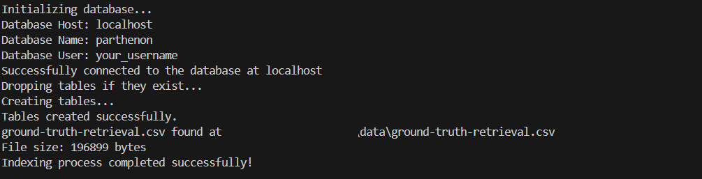

### Running the Application

You have two options for running the application:

**Option 1: Full Docker Compose Setup (Recommended)**

If you have any services running from the database initialization step, use Ctrl+C or run:

```bash
docker-compose down
```

Start all services:

```bash
docker-compose up
```

**Option 2: Running Components Separately**

If you have any services running, stop them:

```bash
docker-compose down
```

Start only the necessary services:

```bash
docker-compose up -d postgres grafana elasticsearch
```

Run the backend locally:

```bash
pipenv shell
cd backend/app
export POSTGRES_HOST=localhost
export ELASTIC_URL=http://localhost:9200
python app.py
```

You will see the following message:
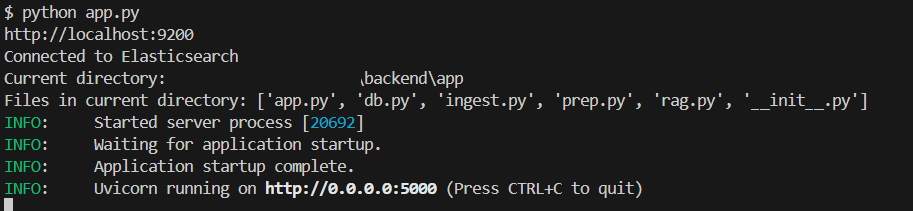

## Using the Application

Use the provided `test.py` script or curl commands to interact with the API:

### Using `requests`

When the application is running, you can use [requests](https://requests.readthedocs.io/en/latest/) to send questions to the provided [test.py](test.py) script.

In a new terminal, in root dir, interact with the application:

```bash
pipenv run python test.py
```

It sends a random question from the ground truth dataset to the app
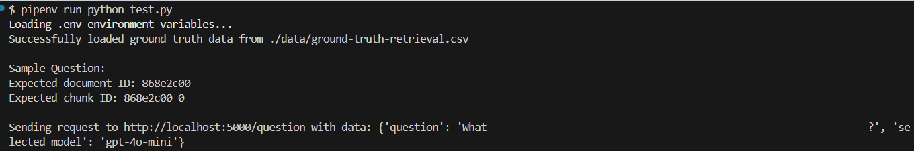
and outputs an API response that contains several fields, including a `conversation_id`  and other relevant details.
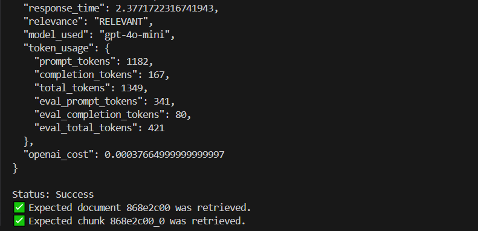

### Using `CURL`

Use `curl` to interact with the API:

To get a similar output install `jq`. For Windows (using Chocolatey):
```bash
choco install jq
```

then run the following command:

```bash
curl -X POST http://localhost:5000/question -H "Content-Type: application/json" -d '{"question": "Which platforms are referenced for deploying EVM contracts using Hardhat?", "selected_model": "gpt-4o-mini"}' | jq '{
  conversation_id, 
  question: .query, 
  answer, 
  response_time, 
  relevance, 
  model_used, 
  token_usage: {prompt_tokens, completion_tokens, total_tokens, eval_prompt_tokens, eval_completion_tokens, eval_total_tokens}, 
  openai_cost
}'
```

The output will look like this:

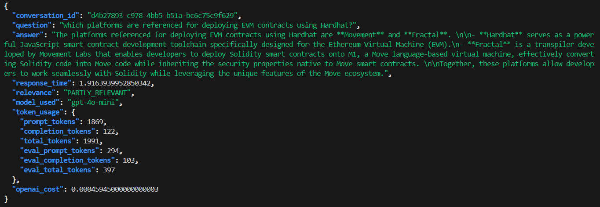

**Sending feedback:**

After receiving an API response, you can send feedback on the conversation (copy-paste the following and hit enter):

```bash
ID="d4b27893-c978-4bb5-b51a-bc6c75c9f629"
URL=http://localhost:5000
FEEDBACK_DATA='{
    "conversation_id": "'${ID}'",
    "feedback": 1
}'

curl -X POST \
    -H "Content-Type: application/json" \
    -d "${FEEDBACK_DATA}" \
    ${URL}/feedback
```

Upon successful submission, you'll receive an acknowledgment message similar to this:

```json
{
    "message": "Feedback received for conversation d4b27893-c978-4bb5-b51a-bc6c75c9f629: 1"
}
```

## Monitoring

To initialize the dashboard, first ensure Grafana is
running (it starts automatically when you do `docker-compose up`).

```bash
pipenv shell
cd grafana
env | grep POSTGRES_HOST
python init.py
```

You'll receive a message confirming successful initialization.

```bash
Dashboard created successfully
Initialization complete. Datasource and dashboard created successfully.
```

Access Grafana at [localhost:3000](http://localhost:3000) with the default credentials (admin/admin).

Grafana dashboard provides visualizations for:

- Last 5 conversations
- User feedback statistics (thumbs up/down)
- Total queries over time
- Token usage and costs
- LLM used
- Query relevance scores
- API response times

This allows you to monitor the performance and usage of the RAG system in real-time.

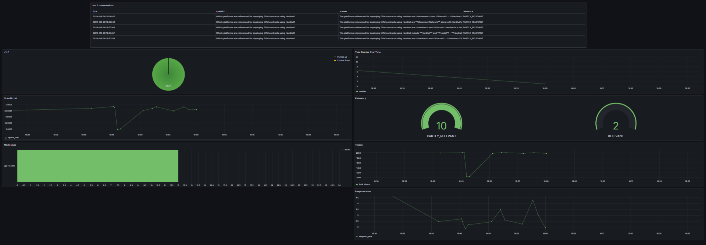

## 💻 Frontend

For more detailed information about the game, please see the [Frontend](frontend.md) documentation.

### Frontend Setup

Make sure the backend services are up:

```bash
docker-compose up
```

1. Install frontend dependencies:

```bash
cd frontend
npm install
```

2. Run the frontend development server:

```bash
npm run dev
```

3. Access the application:

- Open your browser and navigate to `http://localhost:3001` to load the landing page.
- Click the `PLAY NOW` or `Launch Game` button to start.
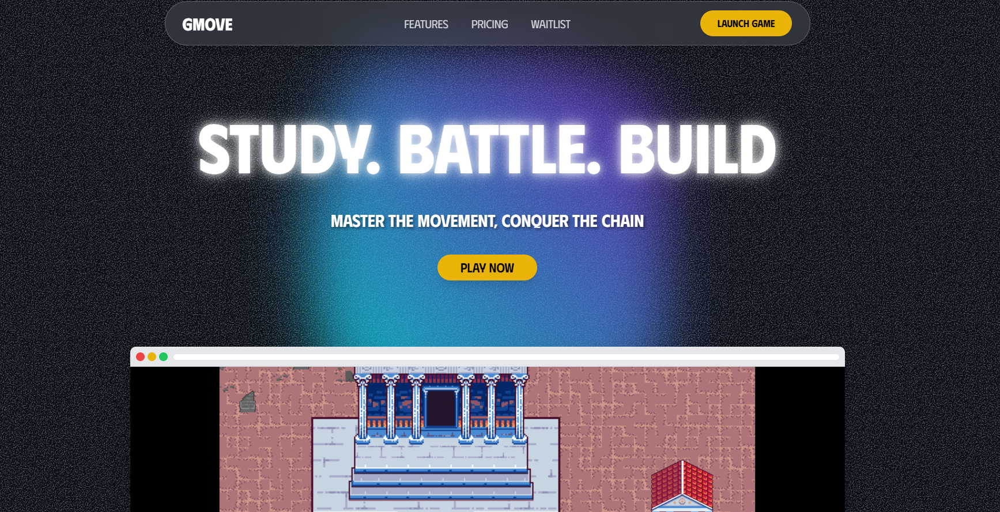

- The game will open at `http://localhost:3001/game`
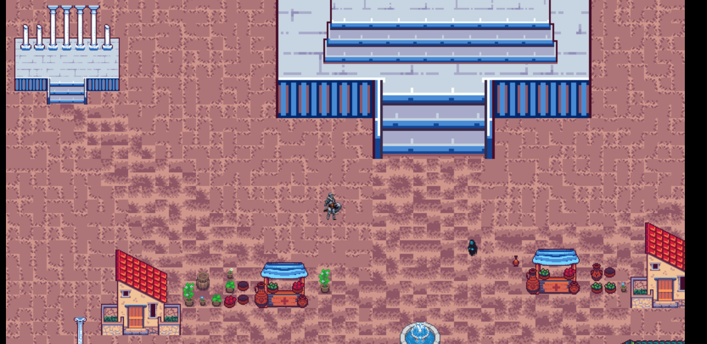

- Use the arrow keys to move the player character close to the NPC. Once a pop-up appears, press `E` to interact.
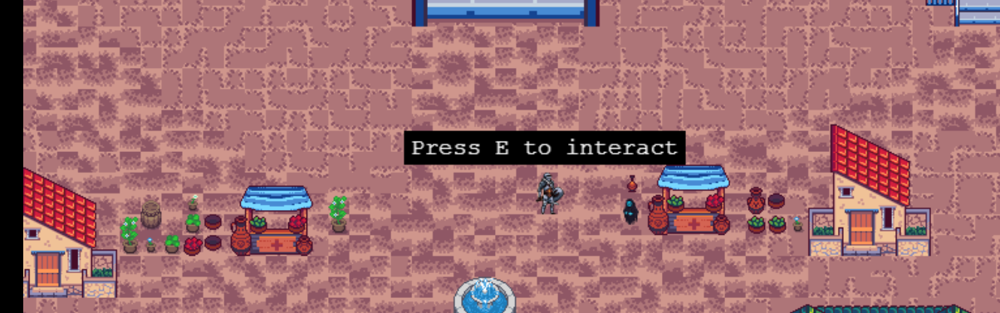

- A pop-up will appear with the following options:
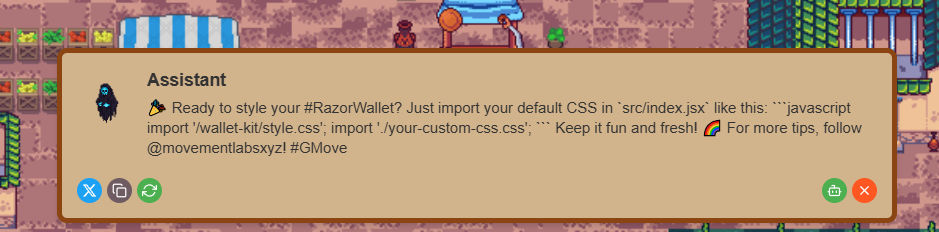

- Share on Twitter
- Copy the fact
- Get a new fact
- Open the chat interface (`InteractionPopup`)

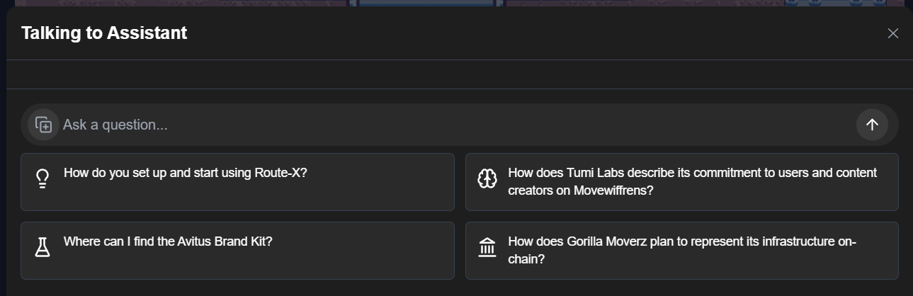

- Close the pop-up when you're done

The `InteractionPopup` uses FAQ from the ground truth, where you can click on them and it pre-fills the chat.

## 🤝 FAQ

For answers to commonly asked questions, please see the [FAQ document](faq.md).

## 🙌 Contributing

1. Fork the repository
2. Create your feature branch (`git checkout -b feature/AmazingFeature`)
3. Commit your changes (`git commit -m 'Add some AmazingFeature'`)
4. Push to the branch (`git push origin feature/AmazingFeature`)
5. Open a Pull Request
6. Issue Tracker: Use GitHub Issues for bug reports and feature requests.

## 📄 License

This project is licensed under the MIT License - see the [LICENSE](LICENSE) file for details.

## 🎗️ Donations

We accept donations to help sustain our project. If you would like to contribute, you can use the following options:

[](https://github.com/sponsors/dimzachar)

<p align="center">
  <a href="https://www.buymeacoffee.com/techietea" target="_blank">
    
  </a>
</p>

**Ethereum Address:**
```
0xeB16AdBa798C64CFdb9A0A70C95e1231e4ADe124
```

Your generosity helps us continue improving Parthenon and creating more exciting features. Thank you for your support! 🙏

## 📬 Contact

For questions, suggestions, or collaboration opportunities:

[](https://www.linkedin.com/in/zacharenakis/)